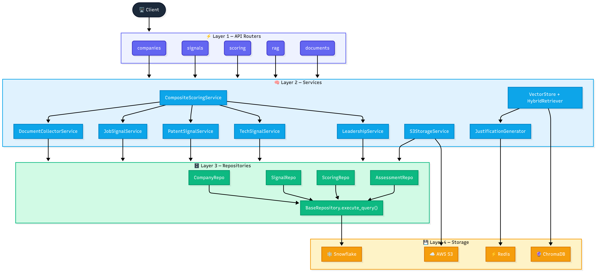
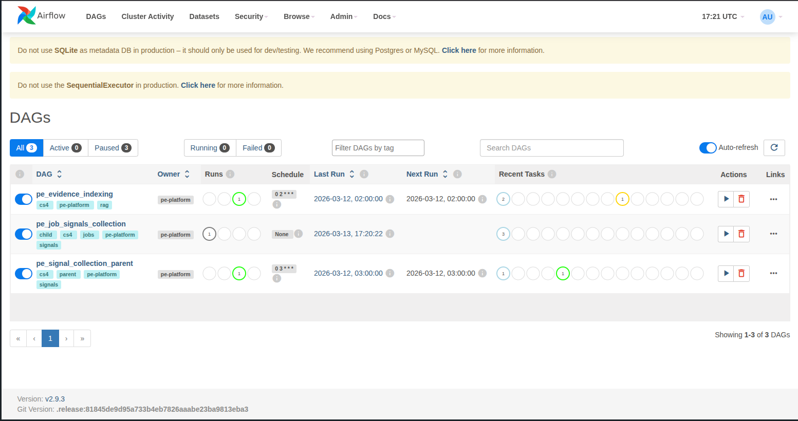

# 🔍 PE Org-AI-R Platform : RAG Search & IC Preparation

> **Case Study 4: From Scores to Cited Justifications**
> Big Data and Intelligent Analytics — Spring 2026 | Team 5

RAG-powered due diligence platform that transforms CS1–CS3 scoring outputs into citation-backed Investment Committee materials. The platform indexes all collected evidence into ChromaDB, retrieves it via hybrid dense + sparse search, and generates IC-ready justifications with specific citations, score levels, and gap analysis through LiteLLM-routed LLMs (Groq + DeepSeek).

**Analysts can now ask natural-language questions and receive cited, evidence-backed answers. ✅**

---

## 🔗 Links

| Resource | URL |
|----------|-----|
| **GitHub Repository** | [PE_OrgAIR_Platform_RAG](https://github.com/BigDataIA-Spring26-Team-5/PE_OrgAIR_Platform_RAG.git) |
| **Project Codelabs** | [CS4 Walkthrough](https://codelabs-preview.appspot.com/?file_id=16_uZuNqImUhPztCSOeEnVWznIwW3TT5R477rsmvLrSA#2) |
|**Demo Video**|[https://northeastern-my.sharepoint.com/](https://northeastern-my.sharepoint.com/:v:/g/personal/bukka_b_northeastern_edu/IQAXchs-_8NKTIRyquLz9pMrAU2Y4OSKWJLDYFLlle0YIew?nav=eyJyZWZlcnJhbEluZm8iOnsicmVmZXJyYWxBcHAiOiJTdHJlYW1XZWJBcHAiLCJyZWZlcnJhbFZpZXciOiJTaGFyZURpYWxvZy1MaW5rIiwicmVmZXJyYWxBcHBQbGF0Zm9ybSI6IldlYiIsInJlZmVycmFsTW9kZSI6InZpZXcifX0%3D&e=gVH4cq)|
|**Streamlit Deployed UI**|[https://pe-org-air-platform-rag.streamlit.app/](https://pe-org-air-platform-rag.streamlit.app/)|

---

## 📑 Table of Contents

1. [Project Overview & Context](#1-project-overview--context)
2. [Objective & Business Problem](#2-objective--business-problem)
3. [Architecture](#3-architecture)
4. [Case Study Progression](#4-case-study-progression)
5. [Pipeline Flows](#5-pipeline-flows)
6. [API Endpoints & Streamlit Dashboard](#6-api-endpoints--streamlit-dashboard)
7. [Setup & Installation](#7-setup--installation)
8. [Project Structure](#8-project-structure)
9. [Summary & Key Takeaways](#9-summary--key-takeaways)
10. [Design Decisions & Tradeoffs](#10-design-decisions--tradeoffs)
11. [Known Limitations](#11-known-limitations)
12. [Team Member Contributions & AI Usage](#12-team-member-contributions--ai-usage)

---

## 1. Project Overview & Context

The **PE Org-AI-R Platform** simulates a Private Equity due-diligence tool that measures how ready a company is to adopt and benefit from AI. CS1–CS3 built a pipeline to assess AI readiness across PE portfolio companies by collecting signals from SEC filings, job boards, patents, and tech stack fingerprinting, then scoring them across seven dimensions into a composite Org-AI-R rating.

While the scores were defensible, analysts had no way to interrogate the underlying evidence in natural language or generate cited justifications ready for an Investment Committee. **CS4 solves this** by introducing a RAG layer: all CS2 evidence is indexed into ChromaDB, retrieved via hybrid dense and sparse search, and passed through LiteLLM-routed LLMs (Groq + DeepSeek) to produce IC-ready justifications with specific citations, score levels, and gap analysis.

The result is a full due diligence workflow — from company registration to streaming chatbot Q&A — automated end-to-end and kept current by nightly Airflow DAGs.

CS4 was built in five phases:

**Phase 1 — Client Wrappers:** Three async client classes (`cs1_client.py`, `cs2_client.py`, `cs3_client.py`) wrap all CS1/CS2/CS3 FastAPI endpoints. These introduced enriched company fields not in prior case studies — `sub_sector`, `revenue_millions`, `employee_count`, `fiscal_year_end` — populated via Groq. Critically, they accept any company ticker, not just the predefined set of 20.

**Phase 2 — ChromaDB Evidence Indexing:** All CS2 evidence is indexed into ChromaDB using `all-MiniLM-L6-v2`. Each piece is indexed once per relevant dimension (weight ≥ 0.15) to prevent dimension-filtered searches from returning empty results.

**Phase 3 — RAG Retrieval:** Combines ChromaDB dense search, BM25 sparse search, and Reciprocal Rank Fusion (RRF). A HyDE layer generates a hypothetical SEC-style excerpt from the user's question before searching. A DimensionMapper routes evidence to scoring dimensions using weight matrices from the CS3 rubric.

**Phase 4 — LLM Routing and Justification:** LiteLLM routes to Groq (fast tasks: keyword expansion, HyDE) and DeepSeek (quality tasks: IC justifications, executive summaries). Each justification cites specific evidence, states the current score level, and identifies gaps to the next rubric level.

**Phase 5 — RAG Endpoints, Streamlit, and Airflow:** New endpoints (`/rag/index`, `/rag/search`, `/rag/justify`, `/rag/ic-prep`, `/rag/chat`) expose the full pipeline. A Streamlit app provides a pipeline UI and company chatbot. Airflow DAGs run nightly at 2 AM to refresh job signals (72-hour window) and re-index ChromaDB.

---

## 2. Objective & Business Problem

CS1 through CS3 built a working AI readiness assessment platform for private equity portfolio analysis: collecting SEC filings, scoring companies across seven AI maturity dimensions, and producing a composite Org-AI-R score. However, the platform had two constraints that limited real-world PE analyst use:

**First**, it only worked with a hardcoded list of 13 pre-configured companies. Analysts could not bring in a new company without a developer adding it to configuration files.

**Second**, all scoring output was static. An analyst who wanted to understand *why* a company scored a particular way on AI Governance, or wanted to ask "what evidence do we have that this company's board is actively involved in AI oversight?" had no way to query the system. They had to manually trace through S3 files and Snowflake tables.

### Objectives

- **Quantify AI Readiness:** Produce a defensible, evidence-backed Org-AI-R score (0–100) for each portfolio company across seven dimensions.
- **Measure the Say-Do Gap:** Compare AI claims in SEC filings (10-K, 10-Q, DEF 14A) against four observable implementation signals to surface alignment or divergence.
- **Automate Evidence Collection:** Replace manual analyst research with automated pipelines spanning job boards, patent databases, technology fingerprinting, and SEC EDGAR.
- **Enforce Architectural Integrity:** CS4 eliminates technical debt accumulated in CS1–CS3 by enforcing strict layer separation (Routers → Services → Repositories → Databases) and centralizing all infrastructure access through single-responsibility services.
- **Enable RAG-Powered IC Prep:** Integrate ChromaDB vector search with BM25 hybrid retrieval so analysts can generate dimension-specific justifications backed by cited SEC filing excerpts.

### Scope

| Phase Activities | Detail |
|:---|:---|
| Data Collection | SEC EDGAR filings, job board scraping, patent API queries, all external signals |
| Signal Processing | Keyword extraction, fuzzy company name matching, category classification |
| Composite Scoring | 7-dimension weighting, TC/VR/PF/HR composite pipeline, Org-AI-R aggregation |
| RAG Integration | Document chunking, vector indexing, hybrid retrieval, LLM-generated justifications |
| API Layer | RESTful FastAPI endpoints for all pipeline stages |
| Data Storage | S3 and Snowflake storage |

### Target Companies

The platform is preconfigured with 20 publicly traded companies across five sectors, representing a realistic PE portfolio for benchmarking, **but configured to also take in any ticker from the user**:

| Sector | Tickers |
|:---|:---|
| Technology | NVDA, AAPL, MSFT, GOOGL, AMZN, META, TSLA, IBM, ORCL, CRM |
| Manufacturing | CAT, DE, GE |
| Retail | WMT, TGT, DG |
| Healthcare | UNH, HCA |
| Financial Services | JPM, GS, ADP, PAYX |
| Media/Entertainment | NFLX |

---

## 3. Architecture

The platform runs as a single FastAPI server. CS1–CS3 routers handle data collection and scoring. CS4 adds the `/rag` router (`app/routers/rag.py`) for indexing, retrieval, justification, and IC prep.

The platform follows a strict four-layer architecture enforced as part of the CS4 refactoring:

**Layer 1 — API Layer (FastAPI Routers):** Thin HTTP wrappers. Routers receive requests, validate inputs via Pydantic models, delegate to a single service, and return structured responses. Routers do not call other routers, do not contain business logic, and do not access databases directly.

**Layer 2 — Service Layer (Business Logic):** All business logic lives here. Services orchestrate multi-step workflows, call external APIs, make LLM calls, and coordinate between repositories. Key services include CompositeScoringService, DocumentCollectorService, JobSignalService, PatentSignalService, TechSignalService, LeadershipService, S3StorageService, VectorStore + HybridRetriever, and JustificationGenerator.

**Layer 3 — Repository Layer (Data Access):** Thin data access objects. All extend `BaseRepository` and exclusively use `BaseRepository.execute_query()` for Snowflake access — no raw connections anywhere.

**Layer 4 — Storage Layer:** Snowflake (primary relational store), S3 (object store for raw/parsed SEC filings), Redis (caching and task state), ChromaDB (vector database for RAG embeddings).

### Tech Stack

| Category | Technology | Version | Purpose |
|:---|:---|:---|:---|
| API Framework | FastAPI | 0.128.0 | REST API, async routing |
| Runtime | Python | ≥3.11 | Application runtime |
| Data Warehouse | Snowflake | 4.2.0 | Primary relational storage |
| Object Storage | AWS S3 (boto3) | 1.42.35 | Document and signal storage |
| Vector DB | ChromaDB | 0.5.23 | RAG embedding storage |
| Cache | Redis | 7.1.0 | Task state, response caching |
| LLM Router | LiteLLM | 1.82.1 | Multi-provider LLM abstraction |
| Embeddings | sentence-transformers | 2.2.0 | all-MiniLM-L6-v2 embedding model |
| BM25 Search | rank_bm25 | 0.2.2 | Keyword retrieval (hybrid RAG) |
| Job Scraping | python-jobspy, Yahoo Finance | 1.1.0 | LinkedIn, Indeed, Glassdoor, portfolio and company information |
| Patent API | PatentsView (httpx) | — | USPTO patent data |
| Tech Detection | BuiltWith API + python-Wappalyzer | — | Website tech stack fingerprinting |
| SEC Filings | sec-edgar-downloader | 5.1.0 | 10-K, 10-Q, 8-K, DEF 14A |
| PDF Parsing | pdfplumber + PyMuPDF | 0.11.9 / 1.26.7 | Document text extraction |
| HTML Parsing | BeautifulSoup4 + lxml | 4.14.3 | SEC HTML filing parsing |
| Browser Automation | Playwright | 1.58.0 | Web scraping |
| Fuzzy Matching | rapidfuzz | 3.14.3 | Company name normalization |
| Data Validation | Pydantic | 2.12.5 | Request/response schemas |
| Containerization | Docker + Docker Compose | — | Deployment (API + Redis) |
| Testing | pytest + moto | 9.0.2 | Unit and integration testing |



---

## 4. Case Study Progression

### CS1 — Platform Foundation (Weeks 1–2)
Built the API layer, data models, Snowflake schema, S3 storage, and Redis caching. Established the entity framework (Companies, Industries, Assessments) that all subsequent case studies build on.

### CS2 — Evidence Collection (Weeks 3–4)
Built two parallel pipelines. The **Document Pipeline** downloads SEC filings (10-K, DEF 14A) from EDGAR, parses them with pdfplumber/BeautifulSoup, extracts key sections (Item 1, 1A, 7), and chunks them into ~500-token segments stored in Snowflake + S3. The **Signal Pipeline** scrapes 4 external signal categories — technology hiring (Indeed via Playwright), innovation activity (USPTO patents), digital presence (BuiltWith/Wappalyzer), and leadership signals (DEF 14A proxy analysis) — normalizing each to 0–100 scores.

### CS3 — Scoring Engine (Weeks 5–6)
Transforms CS2's raw evidence into validated Org-AI-R scores through a 9-step pipeline: evidence mapping (9×7 weight matrix), rubric-based scoring (5-level rubrics for 7 dimensions), talent concentration analysis, VR calculation with balance penalties, position factor computation, sector-adjusted HR, synergy bonus, SEM-based confidence intervals, and full Org-AI-R composite scoring.

### CS4 — RAG Search & IC Preparation (Weeks 7–8) ← **This Submission**
CS4 introduces a Retrieval Augmented Generation layer that connects raw SEC filing evidence directly to the scoring rubric, enabling automated Investment Committee preparation. All CS2 evidence is indexed into ChromaDB, retrieved via hybrid dense + sparse search with HyDE query enhancement and Reciprocal Rank Fusion, and passed through LLM-generated justifications that cite specific evidence, state score levels, and identify gaps. Nightly Airflow DAGs keep job signal data fresh so the ChromaDB index reflects current hiring intent.

---

## 5. Pipeline Flows

### Pipeline 1: Client Wrappers — Consuming CS1, CS2, CS3

CS4's first task was to wrap all prior FastAPI endpoints into three async client classes so the RAG layer could pull data without touching Snowflake or S3 directly.

**`cs1_client.py` — Company Metadata:** Fetches enriched company metadata. CS4 extended the company model with fields that did not exist in CS1–CS3: `sub_sector`, `revenue_millions`, `employee_count`, and `fiscal_year_end` — all populated automatically via a Groq LLM call when a company is registered. The client also removed the 20-company restriction.

**`cs2_client.py` — Signal Evidence:** The most substantial client. It fetches CS2 signal outputs from S3, but critically it cleans them before indexing. SEC filing chunks are filtered in two passes: `_is_toc_chunk()` removes table-of-contents headers and `_is_proxy_boilerplate()` strips repetitive proxy statement language. The client also calls Groq to expand rubric keyword lists per dimension and summarize raw signal outputs into structured paragraphs. It maps each SEC section to its signal category:

| SEC Section | Maps To |
|:---|:---|
| `sec_10k_item_1` | `leadership_signals` |
| `sec_10k_item_1a` | `governance_signals` |
| `sec_10k_item_7` | `innovation_activity` |

**`cs3_client.py` — Dimension Scores & Rubric:** Fetches dimension scores and rubric criteria. Calls Groq to expand rubric criteria into keyword lists, estimate scores for zero-data dimensions, and fill missing metadata fields.

---

### Pipeline 2: ChromaDB Evidence Indexing

All CS2 evidence — job signal outputs, patent records, tech stack fingerprints, SEC chunks, Glassdoor culture signals — is indexed into ChromaDB using the `all-MiniLM-L6-v2` sentence transformer.

**Multi-Dimension Indexing Fix** — the most important architectural decision in this pipeline. In early implementation, each evidence piece was stored under a single primary dimension. Dimension-filtered ChromaDB queries for secondary dimensions returned empty results. CS4 fixed this by indexing each piece **once per dimension** where the signal-to-dimension weight is ≥ 0.15:

| Signal Category | Dimensions Indexed Under |
|:---|:---|
| `technology_hiring` | talent (0.70), tech_stack (0.20), culture (0.10) |
| `innovation_activity` | tech_stack (0.50), use_cases (0.30), data_infra (0.20) |
| `digital_presence` | data_infra (0.60), tech_stack (0.40) |
| `leadership_signals` | leadership (0.45), use_cases (0.25), ai_governance (0.20), culture (0.10) |
| `culture_signals` | culture (0.80), talent (0.10), leadership (0.10) |
| `governance_signals` | ai_governance (0.70), leadership (0.30) |

**Indexing Flow** (`POST /rag/index/{ticker}`):

1. `cs2_client.get_evidence(ticker)` → list of CS2Evidence objects with cleaning applied
2. For each evidence piece, compute dimensions where weight ≥ 0.15
3. `vector_store.index_cs2_evidence(evidence_list)` → batch upsert into ChromaDB with metadata (ticker, dimension, signal_category, source_type, confidence, fiscal_year)
4. `hybrid_retriever.seed_from_evidence(evidence_list)` → build BM25 in-memory inverted index from the same evidence list
5. `cs2_client.mark_indexed(evidence_ids)` → set `indexed_in_cs4 = True`

---

### Pipeline 3: Hybrid Retrieval (Dense + Sparse + RRF + HyDE)

When an analyst asks a question, retrieval runs in **four stages** before any LLM is called.

**Stage 1 — HyDE Query Enhancement:** `HyDERetriever` sends the question to Groq to generate a 150–200 word hypothetical SEC filing excerpt that would contain the answer. That synthetic document becomes the actual search query, substantially improving semantic recall. If the Groq call fails, the original question is used as fallback.

**Stage 2 — Dimension Detection:** The RAG router scores the question against keyword lists for all 7 dimensions, with discriminator terms weighted 3×. If confidence exceeds the threshold, the detected dimension filters the ChromaDB query. If not, Groq classifies the dimension via an LLM call.

**Stage 3 — Dense + Sparse Search:**
- `VectorStore.search()` runs cosine similarity against ChromaDB, filtered by ticker and dimension → top-k results
- `HybridRetriever` runs BM25 against the in-memory index seeded during indexing → top-k results

**Stage 4 — Reciprocal Rank Fusion:** RRF merges both ranked lists: `score = Σ 1/(60 + rank_i)`. Results are deduplicated and re-ranked by combined score. If dimension-filtered search returns fewer than 3 results, the router falls back to source-affinity filtering (governance → SEC sources; culture → Glassdoor; talent → job postings), then to ticker-only unfiltered search.

---

### Pipeline 4: Justification Generation

Each dimension justification ties retrieved evidence to the CS3 rubric, producing a **citation-backed IC-ready paragraph**:

1. `cs3_client.get_dimension_scores(ticker)` → current score and rubric level for the dimension
2. `cs3_client.expand_keywords(dimension)` → Groq-expanded keyword list from rubric criteria
3. Hybrid retrieval → 15 evidence pieces for the dimension
4. `match_to_rubric(evidence, keywords)` → score each piece against rubric terms; filter to relevant subset
5. Classify evidence strength: **Strong** (5+ pieces, ≥1 with confidence ≥ 0.70), **Moderate** (2+), **Weak** (0–1)
6. Identify gaps: which rubric criteria for the next level are absent from current evidence
7. Call DeepSeek → 150–200 word output that states the score and rubric level, cites 2–3 specific evidence pieces, explains what drives the score, names key gaps, and uses professional PE IC language
8. Return `DimensionJustification` (score, level, justification_text, cited_evidence, gaps, evidence_strength)

---

### Pipeline 5: IC Meeting Preparation

The IC prep workflow (`/rag/ic-prep`) orchestrates all seven dimension justifications concurrently and assembles a complete Investment Committee package:

1. `cs1_client.get_company(ticker)` → enriched company metadata
2. `cs3_client.get_assessment(ticker)` → overall assessment and status
3. `asyncio.gather(*[justify(dim) for dim in 7_dimensions])` → all 7 justifications run in **parallel**, reducing total generation time by up to 7×
4. Identify **strengths:** dimensions at rubric level ≥ 4
5. Identify **gaps:** dimensions at rubric level ≤ 2
6. Assess **risks:** talent concentration (TC score), valuation risk, portfolio fit (position factor)
7. Call DeepSeek → executive summary
8. Issue recommendation:

| Recommendation | Criteria |
|:---|:---|
| **PROCEED** | avg_score ≥ 65, no weak dimensions, no high risks, ≤ 1 weak evidence |
| **PROCEED WITH CAUTION** | avg_score ≥ 45, ≤ 2 weak dimensions, ≤ 3 weak evidence |
| **FURTHER DILIGENCE** | All other cases |

---

### Pipeline 6: Airflow Nightly Evidence Refresh

Job posting signals become stale within days. CS4 introduced an Airflow DAG to automate signal freshness without manual intervention.

**DAG:** `evidence_indexing_dag.py`

| Parameter | Value |
|:---|:---|
| Schedule | `0 2 * * *` (nightly at 2 AM) |
| Retry | 1 retry per task, 5-minute delay |

| Task | Action |
|:---|:---|
| `fetch_evidence` | `GET /evidence?indexed=False` — retrieves all CS2 records not yet in ChromaDB; job signals re-collected with `hours_old=72` |
| `index_evidence` | `HybridRetriever` batch-indexes new evidence into ChromaDB; seeds BM25 |
| `mark_indexed` | `cs2_client.mark_indexed(evidence_ids)` — sets `indexed_in_cs4 = True` to prevent re-indexing |

The 72-hour job collection window captures recent postings from the past three days on each run while avoiding duplication with records already indexed from prior runs. The `indexed_in_cs4` flag makes the DAG idempotent.



---

## 6. API Endpoints & Streamlit Dashboard

### CS1 — Company Metadata

| Method | Endpoint | Description |
|:---|:---|:---|
| POST | `/companies` | Register any ticker; Groq auto-populates `sector`, `sub_sector`, `revenue_millions`, `employee_count`, `fiscal_year_end` |
| GET | `/companies/{ticker}` | Retrieve enriched metadata |
| GET | `/companies/{ticker}/dimension-keywords` | Groq-expanded rubric keywords per dimension |

### CS2 — Evidence Collection

| Method | Endpoint | Description |
|:---|:---|:---|
| POST | `/documents/collect` | Download 10-K, 10-Q, 8-K, DEF 14A from SEC EDGAR → S3 → Snowflake |
| POST | `/documents/parse/{ticker}` | Extract text, identify sections (Risk Factors, MD&A, Item 1A) → parsed JSON to S3 |
| POST | `/documents/chunk/{ticker}` | Split into overlapping chunks → S3 + Snowflake |
| POST | `/signals/score/{ticker}/hiring` | Technology hiring signal via JobSpy |
| POST | `/signals/score/{ticker}/innovation` | Innovation signal via PatentsView/USPTO |
| POST | `/signals/score/{ticker}/digital` | Digital presence via BuiltWith + Wappalyzer |
| POST | `/signals/score/{ticker}/leadership` | Leadership signal via SEC DEF 14A |
| POST | `/signals/score/{ticker}/all` | All four signals in one call |
| GET | `/signals/{ticker}/current-scores` | Latest scores without re-running |
| POST | `/glassdoor` | Culture signal → Glassdoor scrape → S3 + Snowflake |
| POST | `/board` | Board governance signal → DEF 14A → board composition + AI expertise score |
| GET | `/evidence` | Aggregated evidence stats; `?indexed=False` used by Airflow DAG |

### CS3 — Scoring

| Method | Endpoint | Description |
|:---|:---|:---|
| POST | `/scoring/{ticker}` | CS2 signals → rubric-score SEC sections → 7 dimension scores → Snowflake |
| GET | `/dimension-scores/{ticker}` | All 7 dimension scores with confidence intervals |
| POST | `/tc-vr/{ticker}` | Talent Concentration + Vulnerability & Readiness |
| POST | `/position-factor/{ticker}` | Portfolio Fit |
| POST | `/hr/{ticker}` | Hold/Rotate |
| POST | `/orgair/{ticker}` | Synergy + final Org-AI-R score |
| POST | `/assessments` | Create IC assessment (draft → in_progress → submitted → approved) |

### CS4 — RAG Endpoints (`/rag`)

#### Indexing

| Method | Endpoint | Description |
|:---|:---|:---|
| POST | `/rag/index/{ticker}` | Fetch CS2 evidence → clean SEC chunks → index into ChromaDB per dimension (weight ≥ 0.15) → seed BM25 → mark indexed |
| POST | `/rag/index` | Bulk index multiple tickers; per-ticker error resilience; returns `results`, `total_indexed`, `failed` |
| DELETE | `/rag/index` | Wipe index; optional `?ticker=` scope |

#### Search

| Method | Endpoint | Description |
|:---|:---|:---|
| POST | `/rag/search` | Hybrid dense + sparse search; optional HyDE enhancement; auto-detects dimension via keyword scoring → Groq LLM fallback |
| GET | `/rag/detect-dimension` | Score a question against all 7 dimension keyword lists and return the detected dimension with confidence |
| GET | `/rag/debug` | Return ChromaDB collection stats, BM25 index state, and active LLM provider configuration |

> **Retrieval fallback order:** dimension-filtered → source-affinity (SEC for governance; Glassdoor for culture; job postings for talent) → ticker-only.

#### Justification & IC Prep

| Method | Endpoint | Description |
|:---|:---|:---|
| GET | `/rag/justify/{ticker}/{dimension}` | CS3 score + rubric → retrieve 15 evidence pieces → match to rubric keywords → DeepSeek generates 150–200 word IC paragraph with citations and gap analysis |
| GET | `/rag/ic-prep/{ticker}` | All 7 justifications via `asyncio.gather()` + executive summary + recommendation (PROCEED / PROCEED WITH CAUTION / FURTHER DILIGENCE) |

> **Optional:** `?dimensions=ai_governance,talent` to focus IC prep on specific dimensions.

#### Chatbot & Ops

| Method | Endpoint | Description |
|:---|:---|:---|
| GET | `/rag/chatbot/{ticker}?question=` | Natural language Q&A; returns 3–4 sentence IC-quality answer with source citations, detected dimension, and supporting evidence list |
| GET | `/rag/status` | ChromaDB doc count, embedding model, active LLM providers |
| GET | `/rag/debug/evidence/{ticker}` | Verify what `cs2_client.get_evidence()` returns — counts by signal category and source type |

#### IC Prep Endpoints

| Method | Endpoint | Description |
|:---|:---|:---|
| GET | `/rag/ic-prep/{ticker}/{dimension}` | Generate IC-ready justification for a dimension score with cited evidence |

#### Analyst Notes Endpoints

| Method | Endpoint | Description |
|:---|:---|:---|
| POST | `/api/v1/analyst-notes/{ticker}/interview` | Submit interview transcript (CEO, CFO, etc.); system stores and indexes for later search |
| POST | `/api/v1/analyst-notes/{ticker}/dd-finding` | Submit a due diligence finding discovered during research |
| POST | `/api/v1/analyst-notes/{ticker}/data-room` | Summary of all documents submitted by company inside the data room |
| GET | `/api/v1/analyst-notes/{ticker}` | List all notes for a given company |
| GET | `/api/v1/analyst-notes/{ticker}/{note_id}` | Retrieve a specific note |
| POST | `/api/v1/analyst-notes/{ticker}/load` | Reload all notes for a company from Snowflake back into memory |

#### Guardrails Implemented

The chatbot endpoint (`GET /rag/chatbot/{ticker}`) applies guards at three layers.

## Layer 1 — Input (`app/guardrails/input_guards.py`)
- **Ticker:** must match `^[A-Z][A-Z0-9\.\-]{0,9}$`
- **Question:** 10–500 characters
- **Dimension:** `None` or one of the 7 valid values
- **Prompt injection:** blocks patterns like `ignore previous instructions`, `you are now`, `forget everything`, `system prompt`, `<|im_start|>`, `[INST]`

## Layer 2 — Context (inline in `app/routers/rag.py`)
- Context capped at **6,000 chars**; truncated with a `[Context truncated…]` suffix if exceeded

## Layer 3 — Output (`app/guardrails/output_guards.py`)
- **Length:** 20–2,000 characters; failures return a guard failure message
- **Grounding:** if evidence is empty but answer contains citation patterns, a disclaimer is appended
- **Refusal:** answers starting with `"I cannot"` / `"I'm unable"` / `"As an AI"` are replaced with a structured fallback

## Errors & Logging
- `400` — blocked input (detail contains reason); `500` — LLM/retrieval failure
- All blocks emit a `rag.guardrail_blocked` structlog event with `guard` and `reason` fields

### Streamlit Dashboard

The dashboard (`streamlit/cs4_app.py`) provides 2 sidebar-nav pages:

| Page | What It Shows |
|:---|:---|
| Pipeline (`views/pipeline_cs4.py`) | Run the AI-readiness pipeline for a company: trigger evidence collection, scoring, and ChromaDB indexing step-by-step with prerequisite enforcement |
| Company Q&A (`views/chatbot_cs4.py`) | RAG chatbot with natural-language questions, cited source evidence, and suggested follow-up questions |

---

## 7. Setup & Installation

### Prerequisites

- Python 3.11 or higher installed
- Docker and Docker Compose installed
- Snowflake account (`PE_ORGAIR_DB` database, `PLATFORM` schema)
- AWS S3 bucket (`pe-orgair-platform-group5`) with access keys
- Redis instance (provided via Docker Compose)
- API credentials: `PATENTSVIEW_API_KEY`, `BUILTWITH_API_KEY`, `SEC_EMAIL`
- LLM Model API keys: Groq and DeepSeek keys

### Step 1: Clone the Repository

```bash
git clone https://github.com/BigDataIA-Spring26-Team-5/PE_OrgAIR_Platform_RAG.git
```

### Step 2: Configure Environment Variables

```bash
cp .env.example .env
```

Configure the following variable groups inside `.env`:

- `SNOWFLAKE_ACCOUNT`, `SNOWFLAKE_USER`, `SNOWFLAKE_PASSWORD`, `SNOWFLAKE_DATABASE` — database connectivity
- `AWS_ACCESS_KEY_ID`, `AWS_SECRET_ACCESS_KEY`, `S3_BUCKET` — raw document storage
- `REDIS_URL` — pipeline result caching
- `PATENTSVIEW_API_KEY` — patent signal collection
- `BUILTWITH_API_KEY` — technology stack detection
- `SEC_EMAIL` — required by SEC EDGAR for rate limiting compliance
- `GROQ_API_KEY` — API key for Groq's ultra-fast LLM inference engine (used via LiteLLM router)
- `DEEPSEEK_API_KEY` — API key for DeepSeek's language models (alternative LLM provider via LiteLLM)
- `CHROMA_API_KEY` — Authentication token for your ChromaDB cloud instance
- `CHROMA_TENANT` — Tenant name that isolates your data within a shared ChromaDB deployment
- `CHROMA_DATABASE` — Specific database within your tenant to store/query vector embeddings
- `CHROMA_HOST` — URL or hostname of your ChromaDB server (e.g., `localhost:8000` or a cloud endpoint)

### Step 3: Install Dependencies

```bash
pip install -r requirements.txt
# OR
poetry install
```

### Step 4: Set Up the Database

Run the schema SQL files against your Snowflake account in order:

```bash
app/database/schema.sql                  # Core CS1 tables
app/database/document_schema.sql          # Documents table
app/database/signals_schema.sql           # Signals tables
app/database/final_scoring_schema.sql     # SCORING output table (CS3)
```

### Step 5: Run with Docker

```bash
docker-compose up -d
docker ps
```

This starts the FastAPI server on port 8000 and Redis on port 6379. Both services are required for full scoring pipeline functionality.

### Step 6: Run the FastAPI Backend Locally

For local development without Docker:

```bash
python -m uvicorn app.main:app --host 0.0.0.0 --port 8000 --reload --log-level info
```

Interactive API documentation is available at `http://localhost:8000/docs` once the server is running.

### Step 7: Collect Evidence Signals

Trigger evidence collection through the Swagger UI at `http://localhost:8000/docs`. Run these endpoints for each ticker:

- `POST /documents/collect/{ticker}` — Download SEC 10-K/DEF-14A, parse, chunk, store
- `POST /glassdoor-signals/{ticker}` — Collect and score Glassdoor culture signal
- `POST /board-governance/analyze/{ticker}` — Analyze DEF-14A for board AI governance score
- `POST /signals/extract/{ticker}` — Extract digital, innovation, and hiring signals

### Step 8: Run the Scoring Pipeline

```bash
POST /scoring/orgair/portfolio
```

### Step 9: Launch the Streamlit Dashboard

```bash
streamlit run streamlit/cs4_app.py
# Dashboard: http://localhost:8501
```

### Running Tests

```bash
pytest                                          # All tests
pytest --cov=app --cov-report=term-missing      # With coverage
```

---

## 8. Project Structure

```
PE_OrgAIR_Platform_RAG/
├── app/
│   ├── main.py                          # FastAPI application entry point
│   ├── config.py                        # Environment configuration
│   ├── routers/
│   │   ├── rag.py                       # ⭐ CS4 RAG endpoints (/rag/*)
│   │   ├── analyst_notes.py             # Analyst notes endpoints (/api/v1/analyst-notes/*)
│   │   ├── orgair_scoring.py            # CS3 scoring endpoints
│   │   └── ...                          # CS1/CS2 endpoints
│   ├── services/
│   │   ├── llm/
│   │   │   └── router.py               # LiteLLM routing (Groq/DeepSeek/Claude)
│   │   ├── integration/
│   │   │   ├── cs1_client.py           # Company metadata wrapper
│   │   │   ├── cs2_client.py           # Signal evidence wrapper
│   │   │   └── cs3_client.py           # Dimension scores wrapper
│   │   ├── search/
│   │   │   └── vector_store.py          # ChromaDB vector store
│   │   ├── retrieval/
│   │   │   ├── hybrid.py                # BM25 + Vector + RRF fusion
│   │   │   ├── hyde.py                  # HyDE query enhancement
│   │   │   └── dimension_mapper.py      # Source → dimension routing
│   │   ├── justification/
│   │   │   └── generator.py             # LLM justification generator
│   │   ├── workflows/
│   │   │   └── ic_prep.py               # IC preparation orchestration
│   │   └── ...                          # CS1-CS3 services
│   ├── guardrails/
│   │   ├── input_guards.py              # Ticker/question/injection validation
│   │   └── output_guards.py             # Length/grounding/refusal checks
│   ├── prompts/
│   │   └── rag_prompts.py               # LLM prompt templates
│   ├── scoring/                         # CS3 Scoring Engine
│   ├── pipelines/                       # CS2 data collection
│   ├── models/                          # Pydantic data models
│   ├── repositories/                    # Snowflake data access
│   └── database/                        # SQL schema files
├── dags/
│   └── evidence_indexing_dag.py         # Airflow nightly refresh
├── streamlit/
│   ├── cs4_app.py                       # ⭐ CS4 Streamlit entry point
│   ├── app.py                           # Legacy app
│   └── views/
│       ├── pipeline_cs4.py              # Pipeline trigger UI
│       └── chatbot_cs4.py               # Company Q&A chatbot UI
├── chroma_data/                         # ChromaDB persistent storage
├── tests/                               # Test suite
├── Dockerfile                           # Container configuration
├── docker-compose.yml                   # Multi-service orchestration
├── requirements.txt                     # Python dependencies
└── .env.example                         # Environment template
```

---

## 9. Summary & Key Takeaways

CS4 takes everything built in CS1 through CS3 and makes it actually usable in a due diligence meeting. The scoring pipeline was solid, but analysts had no way to ask "why does this company score a 3 on AI governance?" and get a cited, evidence-backed answer. That is what CS4 solves.

The client wrappers pull evidence from all three prior case studies into a single RAG layer, and the CS2 client in particular does the heavy lifting of cleaning SEC chunks before they ever reach ChromaDB, because raw filings are full of table of contents headers and proxy boilerplate that would tank retrieval quality.

From there, the hybrid retrieval stack combines vector search, BM25, and RRF fusion so that questions phrased in analyst language still find evidence written in SEC filing language. The justification generator then ties it all together, pulling the CS3 rubric score, retrieving relevant evidence, and asking DeepSeek to write an IC paragraph that cites sources and names the gaps.

Nightly Airflow DAGs keep job signal data fresh so the ChromaDB index reflects current hiring intent, not stale snapshots.

### The RAG Integration Framework

- **VectorStore (ChromaDB):** Documents, signals, and assessment data are embedded using `all-MiniLM-L6-v2` and stored in ChromaDB collections persisted to a Docker volume at `/app/chroma_data`.
- **Hybrid Retrieval (BM25 + Vector):** BM25 keyword search provides high precision for exact terminology; vector similarity provides high recall for semantically related content. Both return top 5 results, merged and re-ranked.
- **Dimension Mapper:** Routes retrieved chunks to relevant scoring dimensions using source affinity rules (10-K Item 1 → Data Infrastructure, Tech Stack, Use Cases; DEF 14A → AI Governance, Leadership; Job signals → Talent, Culture).
- **Justification Generator:** Calls the LLM router with the dimension, retrieved evidence chunks with citations, and scoring rubric criteria. Returns a score, narrative justification, and specific citations.
- **IC Prep Workflow:** Runs the full RAG pipeline for all seven dimensions, aggregates scores, generates an executive summary covering AI readiness, risk factors, board governance assessment, and peer benchmarking context.

### LLM Provider Strategy

| Environment | Primary | Fallback |
|:---|:---|:---|
| Testing (current) | Groq | DeepSeek |
| Production (ready) | Claude Sonnet | Claude Haiku |

Switching to production requires: adding `ANTHROPIC_API_KEY` to `.env`, uncommenting the production block in `app/services/llm/router.py`, and re-indexing ChromaDB (embedding model change requires re-ingestion).

### Orchestration Pattern

```
Analyst (Swagger UI or curl)
  → POST /api/v1/signals/score/{ticker}/all
    → FastAPI Router (validates request)
      → JobSignalService (sync: score, store)
        → BackgroundTasks (async: patent, digital, leadership in parallel)
          → Redis (task state: pending → running → complete)
          → Snowflake + S3 (persist results)
```

```bash
# Trigger all companies in one call
curl -X POST http://localhost:8000/api/v1/signals/score/all
curl -X POST http://localhost:8000/api/v1/scoring/all
```

---

## 10. Design Decisions & Tradeoffs

### Design Decisions

- **Async client wrappers over direct DB access:** The cs1, cs2, and cs3 clients call the FastAPI layer via httpx rather than touching Snowflake or S3 directly. If any CS1–CS3 schema changes, only the client files need updating — not the entire RAG system. The trade-off is loopback HTTP latency on every evidence fetch.

- **BM25 seeded from evidence objects, not ChromaDB queries:** ChromaDB Cloud API filter behavior was found to return inconsistent results when used to seed BM25, so the sparse index is built directly from the CS2Evidence list at indexing time. This guarantees the keyword index and vector index cover exactly the same documents. The downside is that BM25 lives in memory — after a service restart it must be rebuilt.

- **Task-based LLM routing via LiteLLM:** Model selection is determined by task type. Fast, cheap tasks (keyword expansion, HyDE, dimension classification) route to Groq. Quality-critical tasks (IC justification, executive summary, chat response) route to DeepSeek. Switching to Claude Sonnet in production requires changing two lines in `router.py`.

- **Airflow for job signals only:** Only job posting data refreshes nightly because it is the only signal with a short relevance window. Patent, SEC filing, and tech stack signals change slowly enough that on-demand collection is sufficient.

---

## 11. Known Limitations

1. **BM25 resets on service restart.** The in-memory sparse index is lost whenever the container restarts. The Airflow DAG rebuilds it nightly, but between a restart and the next 2 AM run, `/rag/search` falls back to dense-only retrieval without signalling that sparse search is inactive.

2. **HyDE adds latency per search call.** Each request with `use_hyde=true` makes an additional Groq LLM call before searching, adding roughly 1–3 seconds. For the Streamlit chatbot this is acceptable; for high-frequency querying it would need to be made optional or cached.

3. **LLM non-determinism in justifications.** Two identical `/rag/justify` calls can produce slightly different narratives. Structured prompts and rubric anchoring reduce but do not eliminate this. Justification text should always be treated as a first draft for analyst review.

4. **Groq enrichment quality varies for less-known companies.** Sub-sector, revenue, and employee count are populated via Groq LLM inference. For private companies, small-cap tickers, or recent spin-offs, Groq may return null or inaccurate values. There is no validation layer.

5. **ChromaDB scalability ceiling.** ChromaDB is appropriate for the current portfolio size. At hundreds of companies with multi-dimension indexing, a managed vector database would be needed.

---

## 12. Team Member Contributions & AI Usage

### Bhavya

Bhavya designed the end-to-end pipeline architecture and built the Streamlit application, covering both the pipeline trigger view with its nine-step prerequisite-enforced flow and the company chatbot view with the evidence panel and suggested questions. She also worked alongside Aqeel to integrate the Airflow scheduling layer that keeps job signal data and ChromaDB indexing current on a nightly basis.

### Deepika

Deepika built the CS1, CS2, and CS3 client wrapper files that form the bridge between the RAG layer and the prior case study pipelines. She extended the company model with enriched fields like sub-sector, revenue, and employee count, and ensured the platform could accept any company ticker a user provides rather than being limited to a predefined list. She also handled project documentation.

### Aqeel

Aqeel designed and built the RAG foundation — the ChromaDB vector store with multi-dimension indexing, the hybrid retriever combining dense search, BM25, and RRF fusion, the HyDE query enhancer, the LiteLLM routing layer across Groq and DeepSeek, and the justification generator that produces IC-ready evidence-cited paragraphs. He also collaborated with Bhavya on integrating the Airflow DAGs for nightly evidence refresh.

### AI Tools Usage Disclosure

We used Claude Code (architecture, scaffolding, and documentation) and ChatGPT (formula verification). All AI-generated code was reviewed and tested against expected score ranges. AI served as a productivity aid, not a substitute for understanding the scoring methodology.

### Resources

| Resource | Link |
|:---|:---|
| GitHub Repository | https://github.com/BigDataIA-Spring26-Team-5/PE_OrgAIR_Platform_RAG.git |
| FastAPI Documentation | https://fastapi.tiangolo.com/ |
| Snowflake Documentation | https://docs.snowflake.com/ |
| SEC EDGAR | https://www.sec.gov/edgar |
| sec-edgar-downloader (PyPI) | https://pypi.org/project/sec-edgar-downloader/ |
| pdfplumber (PyPI) | https://pypi.org/project/pdfplumber/ |
| PatentsView API | https://patentsview.org/apis/purpose |
| python-jobspy (PyPI) | https://pypi.org/project/python-jobspy/ |
| Streamlit Documentation | https://docs.streamlit.io/ |

---

*Big Data and Intelligent Analytics — Spring 2026*
*Case Study 4: RAG Search — "From Scores to Cited Justifications"*
